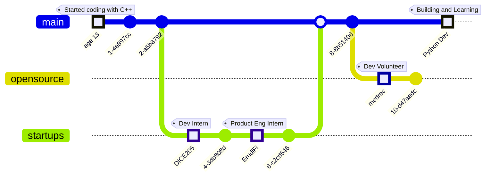

```mermaid
    gitGraph
        commit id: "age 13" type: HIGHLIGHT tag: "Started coding with C++"
        commit
        commit
        branch startups order: 2
        checkout startups
        commit id: "DICE205" type: HIGHLIGHT tag: "Dev Intern"
        commit
        commit id: "ErudiFi" type: HIGHLIGHT tag: "Product Eng Intern"
        commit
        checkout main
        merge startups
        commit
        branch opensource order: 1
        checkout opensource
        commit id: "medrec" type: HIGHLIGHT tag: "Dev Volunteer"
        commit
        checkout main
        commit id: "Python Dev" type: HIGHLIGHT tag: "Building and Learning"
```

<!--  -->

 
